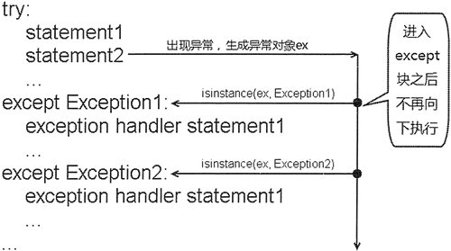
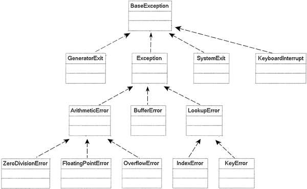

##### @Author  : Roger TX (425144880@qq.com)  
##### @Link    : https://github.com/paotong999

# 一、错误与异常
在程序运行过程中，总会遇到各种各样的错误。
1. 有的错误是程序编写有问题造成的，比如本来应该输出整数结果输出了字符串，这种错误我们通常称之为bug，bug是必须修复的。
2. 有的错误是用户输入造成的，比如让用户输入email地址，结果得到一个空字符串，这种错误可以通过检查用户输入来做相应的处理。
3. 还有一类错误是完全无法在程序运行过程中预测的，比如写入文件的时候，磁盘满了，写不进去了，或者从网络抓取数据，网络突然断掉了。这类错误也称为异常，在程序中通常是必须处理的，否则，程序会因为各种问题终止并退出。

Python内置了一套异常处理机制，来帮助我们进行错误处理。

***

# 二、Python 的异常机制
Python 的异常机制主要依赖 try 、except 、else、finally 和 raise 五个关键字：
- try 关键字后缩进的代码块简称 try 块，它里面放置的是可能引发异常的代码；
- 在 except 后对应的是异常类型和一个代码块，用于表明该 except 块处理这种类型的代码块；
- 在多个 except 块之后可以放一个 else 块，表明程序不出现异常时还要执行 else 块；
- 最后还可以跟一个 finally 块，finally 块用于回收在 try 块里打开的物理资源，异常机制会保证 finally 块总被执行；
- raise 用于引发一个实际的异常，raise 可以单独作为语句使用，引发一个具体的异常对象；

Python 完整的异常处理语法结构如下：
```
try:
    #业务实现代码
except SubException as e:
    #异常处理块1
    ...
except SubException2 as e:
    #异常处理块2
    ...
else:
    #正常处理块
finally :
    #资源回收块
    ...
```

***

# 三、使用try...except捕获异常
```
try:
    #业务实现代码
    ...
except (Error1, Error2, ...) as e:
    alert 不合法
```
如果在执行 try 块里的业务逻辑代码时出现异常，系统自动生成一个异常对象，该异常对象被提交给 Python 解释器，这个过程被称为引发异常。
> 当 Python 解释器收到异常对象时，会寻找能处理该异常对象的 except 块
> - 如果找到合适的 except 块，则把该异常对象交给该 except 块处理，这个过程被称为捕获异常。
> - 如果 Python 解释器找不到捕获异常的 except 块，则运行时环境终止，Python 解释器也将退出。
```
import sys
try:
    a = int(sys.argv[1])
    b = int(sys.argv[2])
    c = a / b
    print("您输入的两个数相除的结果是：", c )
except IndexError:
    print("索引错误：运行程序时输入的参数个数不够")
except ValueError:
    print("数值错误：程序只能接收整数参数")
except ArithmeticError:
    print("算术错误")
except Exception:
    print("未知异常")
```

***

# 四、异常类的继承体系
[异常类的继承体系](https://docs.python.org/zh-cn/3/library/exceptions.html#exception-hierarchy)
当 Python 解释器接收到异常对象时，如何为该异常对象寻找 except 块呢？上面程序中 except 块的 `except IndexError`：这意味着每个 except 块都是专门用于处理该异常类及其子类的异常实例。

当 Python 解释器接收到异常对象后，会依次判断该异常对象是否是 except 块后的异常类或其子类的实例，如果是，Python 解释器将调用该 except 块来处理该异常；否则，再次拿该异常对象和下一个 except 块里的异常类进行比较。

## 4.1 Python 异常捕获流程示意图


在 try 块后可以有多个 except 块，这是为了针对不同的异常类提供不同的异常处理方式。
- 当程序发生不同的意外情况时，系统会生成不同的异常对象
- Python 解释器就会根据该异常对象所属的异常类来决定使用哪个 except 块来处理该异常。
- 通常情况下，如果 try 块被执行一次，则 try 块后只有一个 except 块会被执行，不可能有多个 except 块被执行。



上面程序通过 sys 模块的 argv 列表来获取运行 Python 程序时提供的参数。
> 1. 其中 sys.argv[0] 通常代表正在运行的 Python 程序名，sys.argv[1] 代表运行程序所提供的第一个参数，sys.argv[2] 代表运行程序所提供的第二个参数……依此类推。
> 2. Python 用 import 例来导入模块，关于模块和导入模块会在后续章节进行详细讲解。

上面程序针对 IndexError、ValueError、ArithmeticError 类型的异常，提供了专门的异常处理逻辑。
- 如果在运行该程序时输入的参数不够，将会发生索引错误，Python 将调用 IndexError 对应的 except 块处理该异常。
- 如果在运行该程序时输入的参数不是数字，而是字母，将发生数值错误，Python 将调用 ValueError 对应的 except 块处理该异常。
- 如果在运行该程序时输入的第二个参数是 0，将发生除 0 异常，Python 将调用 ArithmeticError 对应的 except 块处理该异常。
- 如果在程序运行时出现其他异常，该异常对象总是 Exception 类或其子类的实例，Python 将调用 Exception 对应的 except 块处理该异常。

## 4.2 多异常捕获
Python 的一个 except 块可以捕获多种类型的异常。
在使用一个 except 块捕获多种类型的异常时，只要将多个异常类用圆括号括起来，中间用逗号隔开即可，其实就是构建多个异常类的元组。
```
import sys
try:
    a = int(sys.argv[1])
    b = int(sys.argv[2])
    c = a / b
    print("您输入的两个数相除的结果是：", c )
except (IndexError, ValueError, ArithmeticError):
    print("程序发生了数组越界、数字格式异常、算术异常之一")
except:
    print("未知异常")
```

## 4.3 访问异常信息
如果程序需要在 except 块中访问异常对象的相关信息，则可通过为异常对象声明变量来实现。

当 Python 解释器决定调用某个 except 块来处理该异常对象时，会将异常对象赋值给 except 块后的异常变量，程序即可通过该变量来获得异常对象的相关信息。所有的异常对象都包含了如下几个常用属性和方法：
- args：该属性返回异常的错误编号和描述字符串。
- errno：该属性返回异常的错误编号。
- strerror：该属性返回异常的描述宇符串。
- with_traceback()：通过该方法可处理异常的传播轨迹信息。
```
def foo():
    try:
        fis = open("a.txt");
    except Exception as e:
        # 访问异常的错误编号和详细信息
        print(e.args)
        # 访问异常的错误编号
        print(e.errno)
        # 访问异常的详细信息
        print(e.strerror)
foo()
```

***

# 五、else块
在 Python 的异常处理流程中还可添加一个 else 块，当 try 块没有出现异常时，程序会执行 else 块。
```
s = input('请输入除数:')
try:
    result = 20 / int(s)
    print('20除以%s的结果是: %g' % (s , result))
except ValueError:
    print('值错误，您必须输入数值')
except ArithmeticError:
    print('算术错误，您不能输入0')
else:
    print('没有出现异常')
```
只有当 try 块没有异常时才会执行 else 块，那么为什么不直接把 else 块的代码放在 try 块的代码后面？
> 当 try 块没有异常，而 else 块有异常时，放在 else 块中的代码所引发的异常不会被 except 块捕获。

***

# 六、finally块
在异常处理语法结构中，只有 try 块是必需的，也就是说：
- 如果没有 try 块，则不能有后面的 except 块和 finally 块；
- except 块和 finally 块都是可选的，但 except 块和 finally 块至少出现其中之一，也可以同时出现；
- 不能只有 try 块，既没有 except 块，也没有 finally 块；
- 可以有多个 except 块，但捕获父类异常的 except 块应该位于捕获子类异常的 except 块的后面；
- 多个 except 块必须位于 try 块之后，finally 块必须位于所有的 except 块之后。

不管 try 块中的代码是否出现异常，也不管哪一个 except 块被执行，甚至在 try 块或 except 块中执行了 return 语句，finally 块总会被执行。
> 1. 在 try 块、except 块中使用 os.exit(1) 语句来退出 Python 解释器，则 finally 块将失去执行的机会。
> 2. 调用 sys.exit() 方法退出程序不能阻止 finally 块的执行，这是因为 sys.exit() 方法本身就是通过引发 SystemExit 异常来退出程序的。

在通常情况下，不要在 finally 块中使用如 return 或 raise 等导致方法中止的语句，在 finally 块中使用了 return 或 raise 语句，将可能会导致 try 块、except 块中的 return、raise 语句失效。
**如果 Python 程序在执行 try 块、except 块时遇到了 return 或 raise 语句**
> 1. 这两条语句都会导致该方法立即结束，那么系统执行这两条语句并不会结束该方法，而是去寻找该异常处理流程中的 finally 块
> 2. 如果没有找到 finally 块，程序立即执行 return 或 raise 语句，方法中止
> 3. 如果找到 finally 块，系统立即开始执行 finally 块，当 finally 块执行完成后，系统才会再次跳回来执行 try 块、except 块里的 return 或 raise 语句
> 4. 如果在 finally 块里也使用了 return 或 raise 等导致方法中止的语句，finally 块己经中止了方法，系统将不会跳回去执行 try 块、except 块里的任何代码。

***

# 七、Python raise用法
Python 允许程序自行引发异常，自行引发异常使用 raise 语句来完成。
如果需要在程序中自行引发异常，则应使用 raise 语句。raise 语句有如下三种常用的用法：
- raise 单独一个 raise。该语句引发当前上下文中捕获的异常（比如在 except 块中），或默认引发 RuntimeError 异常。
- raise 异常类：raise 后带一个异常类。该语句引发指定异常类的默认实例。
- raise 异常对象：引发指定的异常对象。

上面三种用法最终都是要引发一个异常实例（即使指定的是异常类，实际上也是引发该类的默认实例），raise 语句每次只能引发一个异常实例。
```
def main():
    try:
        # 使用try...except来捕捉异常
        # 此时即使程序出现异常，也不会传播给main函数
        mtd(3)
    except Exception as e:
        print('程序出现异常:', e)
    # 不使用try...except捕捉异常，异常会传播出来导致程序中止
    mtd(3)
def mtd(a):
    if a > 0:
        raise ValueError("a的值大于0，不符合要求")
main()
```

## 7.1 自定义异常类
用户自定义异常都应该继承 Exception 基类或 Exception 的子类，在自定义异常类时基本不需要书写更多的代码，只要指定自定义异常类的父类即可。下面程序创建了一个自定义异常类（程序一）：
> class AuctionException(Exception): pass

程序创建了 AuctionException 异常类，该异常类不需要类体定义，因此使用 pass 语句作为占位符即可。
在大部分情况下，创建自定义异常类都可采用与程序一相似的代码来完成，只需改变 AuctionException 异常的类名即可，让该异常的类名可以准确地描述该异常。

## 7.2 except 和 raise 同时使用
```
class AuctionException(Exception): pass
class AuctionTest:
    def __init__(self, init_price):
        self.init_price = init_price
    def bid(self, bid_price):
        d = 0.0
        try:
            d = float(bid_price)
        except Exception as e:
            # 此处只是简单地打印异常信息
            print("转换出异常：", e)
            # 再次引发自定义异常
            raise AuctionException("竞拍价必须是数值，不能包含其他字符！")    # ① 
            raise AuctionException(e)    # 原始异常 e 包装成了 AuctionException 异常
        if self.init_price > d:
            raise AuctionException("竞拍价比起拍价低，不允许竞拍！")
        initPrice = d
def main():
    at = AuctionTest(20.4)
    try:
        at.bid("df")
    except AuctionException as ae:
        # 再次捕获到bid()方法中的异常，并对该异常进行处理
        print('main函数捕捉的异常：', ae)
main()
```
except 和 raise 结合使用的情况在实际应用中非常常用。实际应用对异常的处理通常分成两个部分：
- 应用后台需要通过日志来记录异常发生的详细情况；
- 应用还需要根据异常向应用使用者传达某种提示；

Python 也允许用自定义异常对原始异常进行包装，只要将上面 ① 号代码改为如下形式即可：
>raise AuctionException(e)

上面就是把原始异常 e 包装成了 AuctionException 异常，这种方式也被称为异常包装或异常转译。

## 7.3 raise 不需要参数
在使用 raise 语句时可以不带参数，此时 raise 语句将会自动引发当前上下文激活的异常；否则，通常默认引发 RuntimeError 异常。

***

# 八、Python 异常使用规范
## 8.1 不要过度使用异常
- 把异常和普通错误混淆在一起，不再编写任何错误处理代码，而是以引发异常来代替错误处理。
- 使用异常处理来代替流程控制。

## 8.2 不要使用过于庞大的 try 块
- 在 try 块里放置大量的代码，然后紧跟大量的 except 块，增加了编程复杂度。

## 8.3 不要忽略捕获到的异常
- 处理异常。对异常进行合适的修复，然后绕过异常发生的地方继续运行；或者用别的数据进行计算，以代替期望的方法返回值；或者提示用户重新操作……总之，程序应该尽量修复异常，使程序能恢复运行。
- 重新引发新异常。把在当前运行环境下能做的事情尽量做完，然后进行异常转译，把异常包装成当前层的异常，重新传给上层调用者。
- 在合适的层处理异常。如果当前层不清楚如何处理异常，就不要在当前层使用 except 语句来捕获该异常，让上层调用者来负责处理该异常。